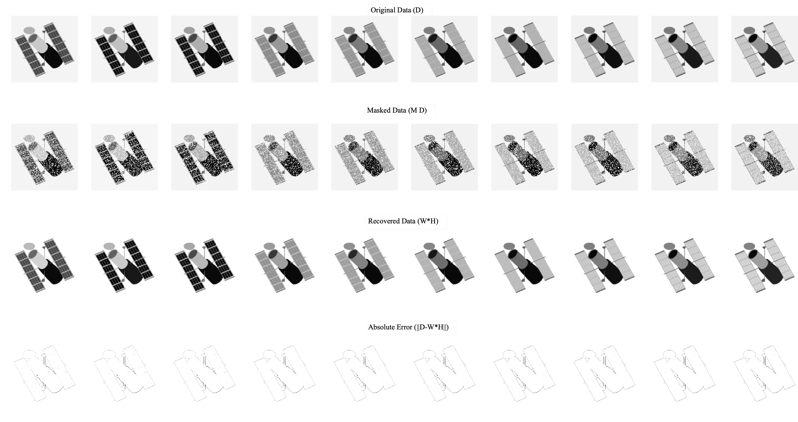

# masked non-negative matrix factorization

Non-negative matrix factorization is a powerful tool for dimensionality reduction and data analysis. Here I have implemented a solver that takes missing entries into account when solving the NNMF problem. The solver is implemented in Matlab and use the method proposed in [this paper](https://ieeexplore.ieee.org/document/4781130) to solve non-negative least squares problem. The code for the paper can be found [here](http://www.cc.gatech.edu/~hpark/software/nmf_bpas.zip).  We use `nnlsm_blockpivot.m` and `solveNormalEqComb.m` files from this package. These files are added under solvers.

This solver follows some of the methods introduced in [this blog post](http://alexhwilliams.info/itsneuronalblog/2018/02/26/censored-lstsq/) and [this paper](https://bmcbioinformatics.biomedcentral.com/articles/10.1186/s12859-019-3312-5).

## Example

The following shows pseudo-code for calling the solver

```matlab
D = ... % your data matrix of shape m x n
M = ... % mask of missing data, matrix m x n (M_{ij}=0 is D_{ij} is missing)
r = ... % desired rank
[W, H, opts] = masked_nnmf(D, M, r,...
                           'init_mode', 'rand',...
                           'maxiter', 100);
```

## masked non-negative matrix factorization problem

Given the non-negative data matrix $D\in\mathbb{R}^{m\times n}_{\geq 0}$, we want to find matrices 

$$W\in\mathbb{R}^{m\times r}_{\geq 0} \quad \text{and} \quad H\in\mathbb{R}^{r\times n}_{\geq 0}$$

such that $D\approx WH$. The optimization problem can be written as 

$$ W^{\ast}, H^{\ast} = \arg\min_{W,H} \|D-WH\|_{F}^2 \quad \text{s.t.} \quad W\in\mathbb{R}^{m\times r},\quad W\geq 0 \quad and \quad H \in \mathbb{R}^{r\times n},\quad H\geq 0.$$

In real application, we might have a case where the columns of $D$ represent different data-points and each row represents a separate features. In this case, we might have a situation where some of the features are missing from the dataset.

Let $M\in\{0,1\}^{m\times n}$  be the masking matrix such that $M_{ij}=0$ iff $D_{ij}$ is missing otherwise $M_{ij}=1$. In this case we only want to consider the error on measured signals. So we get,

$$ W^{\ast}, H^{\ast} = \arg\min_{W,H} \|M\circ(D-WH)\|_{F}^2 \quad \text{s.t.} \quad W\in\mathbb{R}^{m\times r},\quad W\geq 0 \quad \text{and}\quad H \in \mathbb{R}^{r\times n}, \quad H\geq 0.$$


### Example on hubble data matrix

Example using the hubble dataset is shown in [`hubble_test.m`](./tests/hubble_test.m). The results are 


